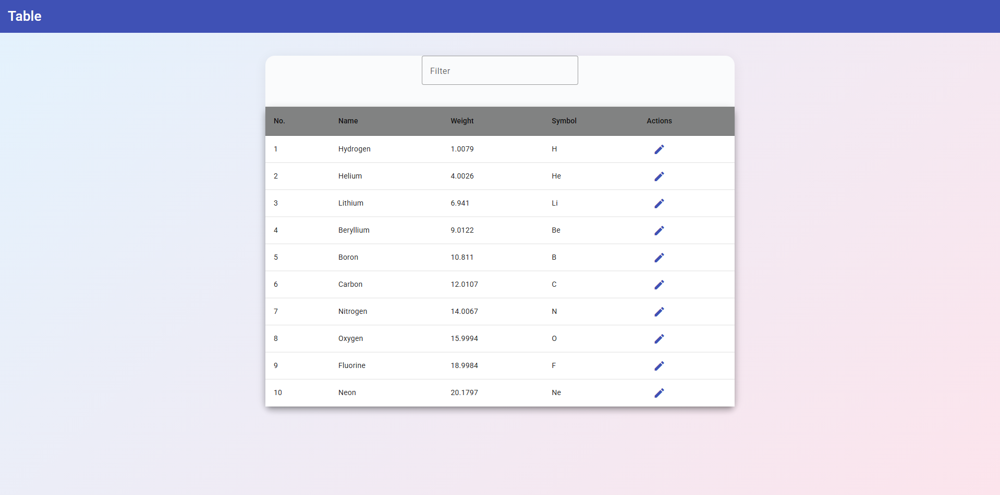

# Angular Table / Periodic Table Editor

A modern Angular 20 app that displays a periodic table of elements with filtering and inline editing, built using Angular Material.

---

## Features / Funkcje

- Table view of elements (Number, Name, Weight, Symbol)  
  Tabela pierwiastków z numerem, nazwą, masą i symbolem
- Edit any row via Material dialog  
  Edycja danych w modalu (Angular Material Dialog)
- Filter elements by any field (with 2s debounce)  
  Filtrowanie danych z opóźnieniem (debounce)
- Responsive, clean Material UI

---

## Technologies / Technologie

- **Angular 20** with standalone components
- **RxJS** – filtering and debounce
- **Angular Material** – table, forms, dialogs

---

## Structure / Struktura

- `main.component.ts` – table, filtering, edit logic
- `edit-dialog.component.ts` – modal for editing data
- Data stored in `signal`, filtered in `computed`

---

## Demo



---

## Installation & Run / Uruchomienie

1. **Clone the repository / Sklonuj repozytorium**
   ```bash
   git clone https://github.com/ParzY1/Angular-table.git
   cd Angular-table
   ```

2. **Install dependencies / Zainstaluj zależności**

   ```bash
   npm install
   ```

3. **Run the app / Uruchom aplikację**

   ```bash
   npx ng serve
   ```
   (or `ng serve` if you have Angular CLI globally)

4. **Open in browser / Otwórz w przeglądarce**

   ```
   http://localhost:4200
   ```

---